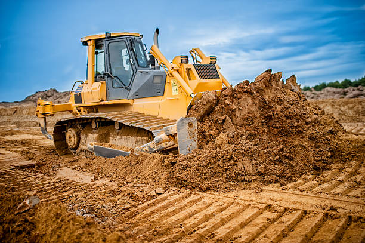
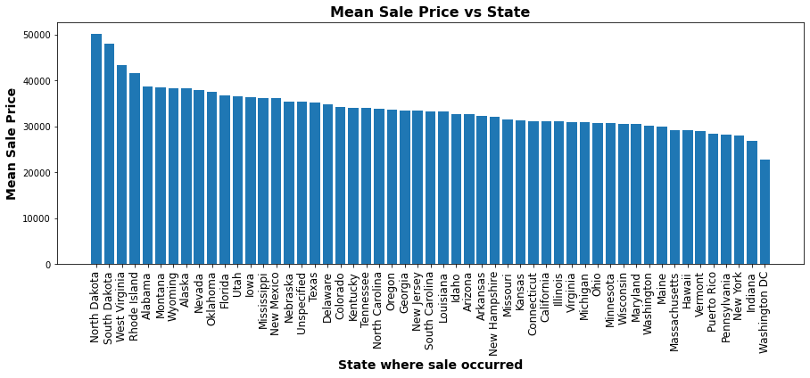
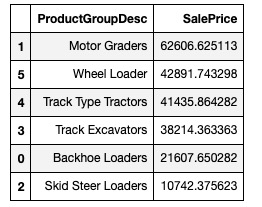
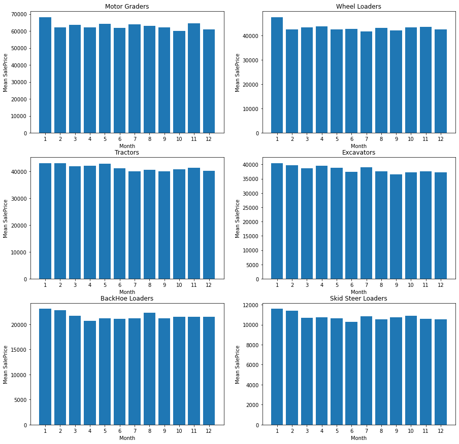
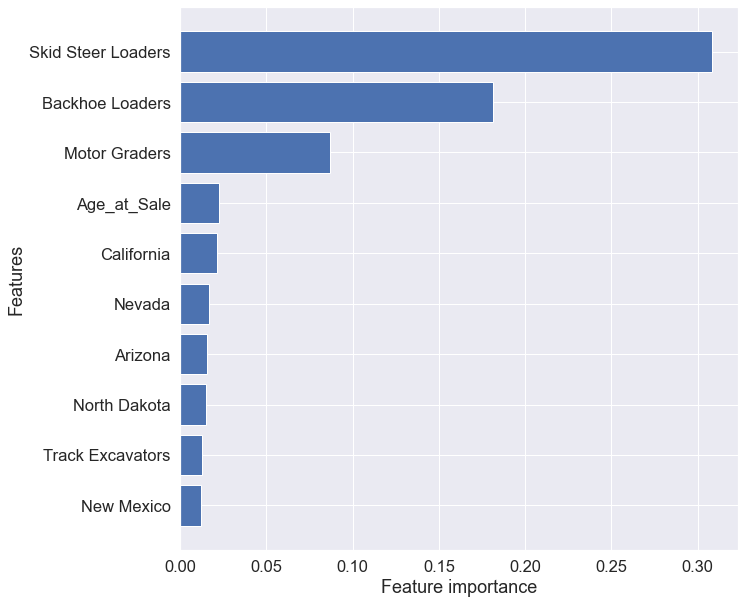

# Bulldozer Sale Prices in the USA

## 0. Introduction
**In this mini Data Science project, I sought to develop a model that can predict the price of a Bulldozer today using historical data.**  
## 1. Problem Definition
**This analysis was approached from the point of view of a company wanting to sell it inventory of used bulldozers at auctions around the USA.**  

The analysis seeks to answer the following business questions:-  
### 1.1 Business Questions
#### 1.1.1 For bulldozers of similar age , usage and model type, is their sale price  dependant on where / what State the bulldozer is sold from ? If so , in which State can we expect to get the best price for our bulldozer ?
#### 1.1.2 What is the sale price variation across diffferent bulldozer models of the same age and usage ?
#### 1.1.3 What is the "best" time of the year to sell a bulldozer on average ?
### 1.2 Modelling Objective
#### 1.2.1 How much can we expect to get for the sale of a particular bulldozer ? Can we build a predictive model to determine what is the appropriate sale price of certain bulldozers ? 
> How well can my model predict the future sale price of a bulldozer, given certain characteristics, using historical data indicating how much similar bulldozers sold for.
## 2. Data
The data is downloaded from the "Kaggle Bluebook for Bulldozers Competition"

Link to the kaggle page : https://www.kaggle.com/c/bluebook-for-bulldozers/data   

The data for this competition is split into three parts:

* Train.csv is the training set, which contains data through the end of 2011.
* Valid.csv is the validation set, which contains data from January 1, 2012 - April 30, 2012 You make predictions on this set throughout the majority of the competition. Your score on this set is used to create the public leaderboard.
* Test.csv is the test set, which won't be released until the last week of the competition. It contains data from May 1, 2012 - November 2012.   

The key fields are in train.csv are:

* SalesID: the uniue identifier of the sale
* MachineID: the unique identifier of a machine.  A machine can be sold multiple times
* saleprice: what the machine sold for at auction (only provided in train.csv)
* saledate: the date of the sale  

The machine_appendix.csv file contains the correct year manufactured for a given machine along with the make, model, and product class details. There is one machine id for every machine in all the competition datasets (training, evaluation, etc.).  

**Refer to the data dictionary for more detialed descriptions of each feature in the aforementioned datasets.**  

**Link to the Data Dicitonary here** -> https://drive.google.com/file/d/137C96v4USPF__97pBNIJ1AaKBkJsOJuB/view?usp=sharing

## 3. Evaluation

The evaluation metrics used for determining the accauracy and reliability of the sale price predictive model will be  the `MAE` **(Mean Absolute Error)** between the actual and the predicted auction sale prices and the `R^2 score`.

### Goal
- **Minimise the RMSLE**
- **Maximise the R^2 score**
## 4. Answering the Business Questions
### 4.1 For bulldozers of similar age , usage and model type, is their sale price  dependant on where / what State the bulldozer is sold from ? If so , in which State can we expect to get the best price for our bulldozer ?  
The analysis of the mean sale price for each bulldozer type revealed that:  

- Generally speaking, it would be more advisable for the company to sell their bulldozers in **North Dakota**. This is beacuase **bulldozers sell for a higher price , on average in North Dakota**.  
- **For Motor Graders**: The best state to sell in is **South Dakota**.
- **For Wheel Loaders**: The best state to sell in is **Rhode Island**.
- **For Tractors**: The best state to sell in is **Nevada**.
- **For Excavators**: The best state to sell in is **North Dakota**.
- **For Backhoe Loaders**: The best state to sell in is **South Dakota**.
- **For Skid Steer Loaders**: The best state to sell in is **Rhode Island**.
### 4.2 What is the sale price variation across different bulldozer models of the same age and usage ?
  
The table above highlights that on average the rankings for the bulldozer classes of the same age ito mean sale price is:
1. Motor Graders.
2. Wheel Loaders.
3. Tractors.
4. Excavators.
5. BackHoe Loaders.
6. Skid Steer Loaders.

#### Take-Aways
Of all the bulldozer classes, `Motor graders` seem to hold their values best over the course of their lifetime usage.  
A company looking to sell bulldozers may consider filling most of their inventory with Motor graders.  

### 4.3 What is the "best" time of the year to sell a bulldozer on average ?
#### Mean Sale Price Variation Across the Months of the Year for each of the Bulldozer Class Types
  
The analysis above revelaed that :
- The months of March and February respectively, recoreded the highest number of sales across the 30 years.
- The months of February, January and May respectively, recorded the highest mean sale price of a bulldozer in general.
- Thursday was the day in which most of the sales were undertaken across the thirty years.
- There was no significant relationship between the day of week in which a sale were underatken and the mean sale price
- Across each and every individual bulldozer class type, the months of January and February recorded the highest mean sale price for the repsective bulldozer class types

### Take-Aways
In general the best time of the year to sell a bulldozer according to the class their belong to are as follows:
1. Motor Graders - January
2. Wheel Loaders - January
3. Tractors - January & February
4. Excavators - January
5. BackHoe Loaders - January, February and August
6. Skid Steer Loaders - January & February

In general the best day of the week to sell a bulldozer is on a Thursday.
## 5. Modelling
### Models I used for the project
For this investigation I modelled the data using :
1. `Random Forest Regressor` (Member of the `Decision Tree` family of regression models)
2. `Ridge Regressor` (Member of the Linear model family)
3. `XGB Regressor` (Member of the `Gradient Boosted` family of regression models)

- I compared the performance of each of the models and used the model with the highest `R^2 score` & lowest `MAE score`.  
- After training all three models , I opted to use the Xgboost Regressor model since it had the highest R^2 score and lowest MAE of all three models prior to any tuning.
- I then tuned the Xgb Regressor model using Sci-kit learn's `Randomized Search CV` which delivered a final model with a r^2 score of 0.514 and an MAE of 11,483.77.
### Feature Importances
Feature importance seeks to establish which features had the most significant effect on the **target** feature that is to be predicted (`SalesPrice`).  
The feature importance values represent the coefficients for the feature variables that the model learnt during training. The higher the value, the more significant of an effect it had towards the model's sale price prediction calculations.  
  
The feature importance analysis revealed that the features that most significantly determined the sale price of a bulldozer in the United States in descending order are:
1. The **Model/Class type** of the bulldozer.
2. The **Age**  of the bulldozer at the time of the sale.
3. The **State**  in which the bulldozer was sold in.  
## 6.Summary of Findings
## Final Remarks on Business Questions

### Question 1: What is the best State to sell a bulldozer in wrt sale price ?
The analysis done to answer this question revealed that **North Dakota** recorded the highest mean sale price across all the bulldozer classes.  
These findings may incentivise a company that re-sells used bulldozers to focus on selling their bulldozers in auctions held in North Dakota.

### Question 2: What is the sale price variation across diffferent bulldozer models of the same age and usage ?
The analysis done to answer this question revealed that the **Motor Grader** class of bulldozers had the highest mean sale price across all of the bulldozer classes of the same age and usage (hours).  

As mentioned earlier, these findings could suggest that a company should fill out most of their inventory with Motor Graders as this class of bulldozers generally sells for more on average.

### Question 3: What is the "best" time of the year to sell a bulldozer on average ?
The analysis revealed that on average, the month that recorded the highest mean sale price of bulldozers across all bulldozer classes, ages and uasge levels was the month of **February**  

Moreover, the analysis revealed that **Thursday** was the day that recorded the highest mean bulldozer sale price.
